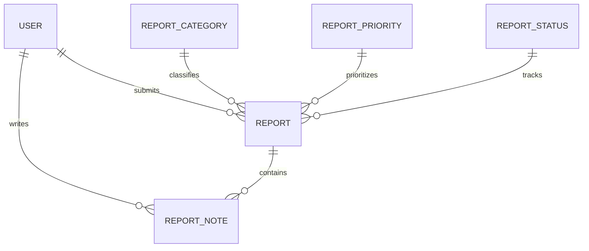
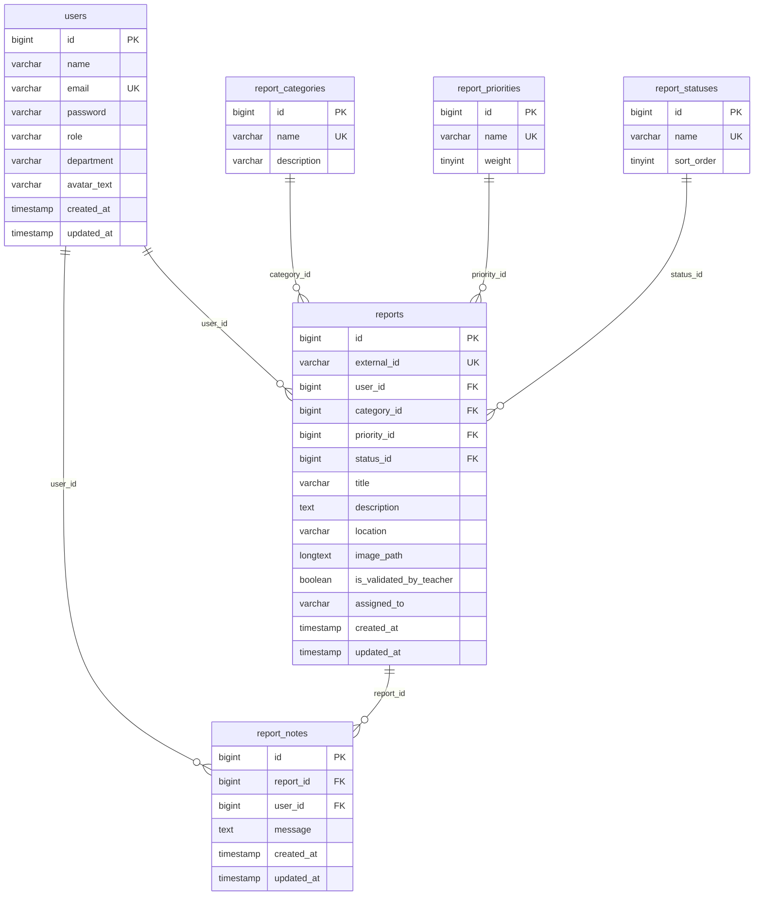

# CampusFix ERD

## Logical ERD

## Physical ERD

## Table Relationship Notes

- `reports.user_id` references the submitting user.
- `report_notes.report_id` references the related report.
- `report_notes.user_id` references the note author and is nullable so notes can remain if an author is removed.
- `reports.category_id`, `reports.priority_id`, and `reports.status_id` reference lookup tables.
