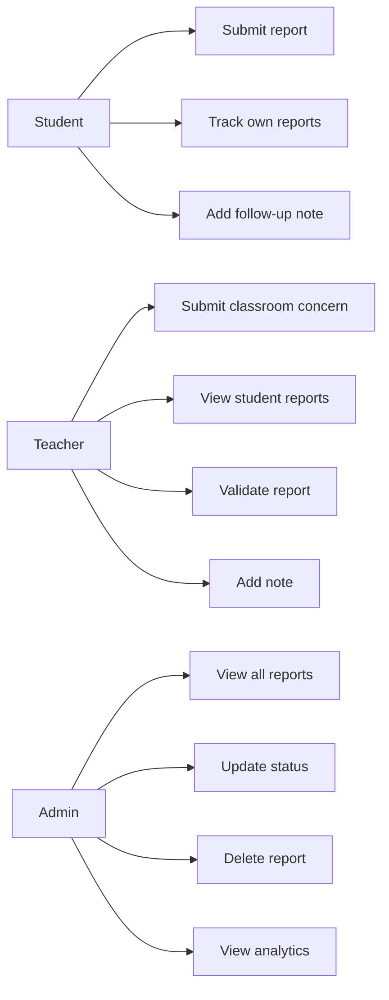
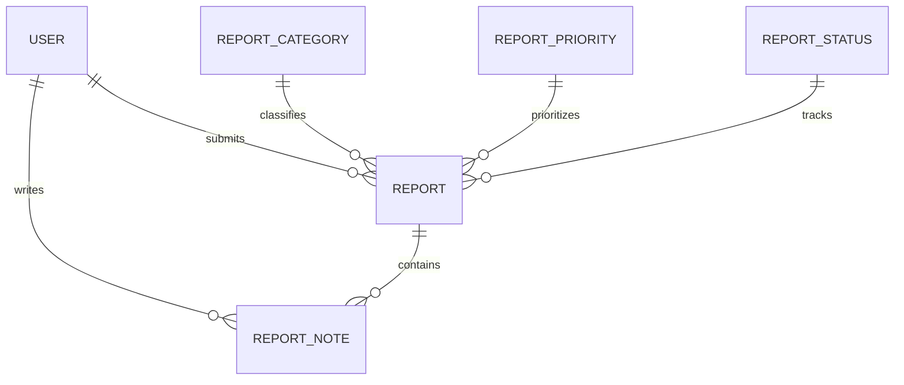
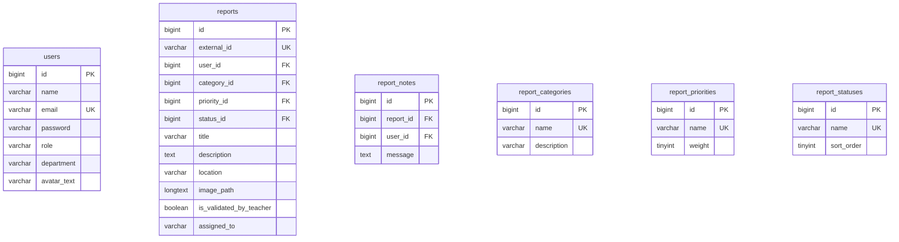
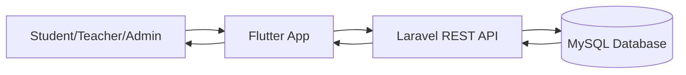
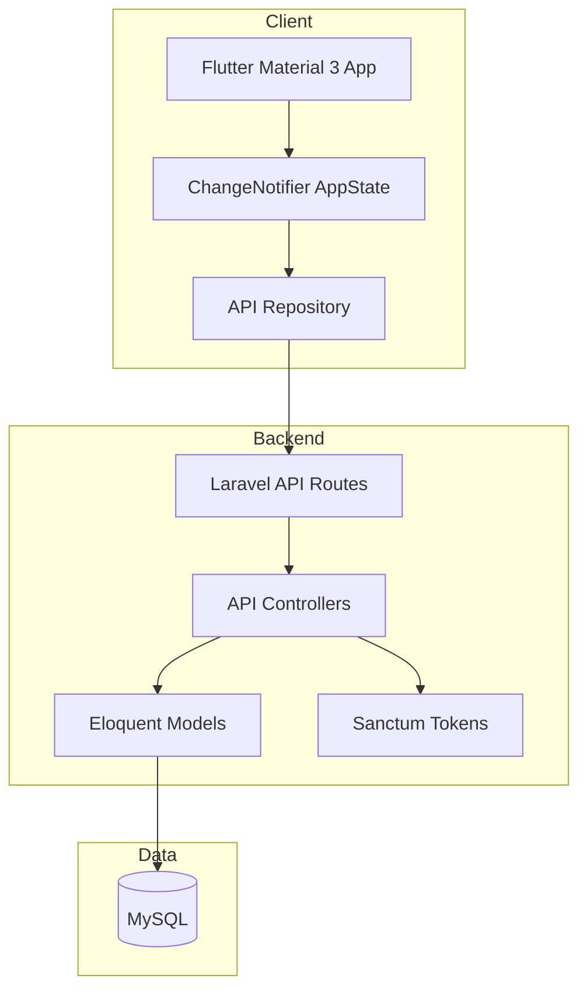

# CampusFix Software Requirements Specification

Version: 1.0  
Standard: IEEE 830-inspired SRS  
Project: Flutter + Laravel + MySQL campus issue reporting system

## 1. Introduction

### 1.1 Purpose

CampusFix is a school/community issue reporting application for students, teachers, and administrators. It supports reporting, validating, tracking, and resolving campus concerns such as damaged chairs, classroom equipment issues, IT concerns, comfort room problems, clinic needs, lost and found items, and maintenance requests.

### 1.2 Scope

The system includes a cross-platform Flutter frontend, a Laravel REST API backend, and a MySQL database. The prototype supports demo authentication with Laravel Sanctum, role-based report visibility, CRUD report workflows, notes, teacher validation, admin status management, and local analytics.

### 1.3 Definitions

- Student: User who submits and tracks own campus issue reports.
- Teacher: User who can submit reports, view student reports, validate student reports, and add notes.
- Admin: User who manages all reports, statuses, notes, users, and analytics.
- Report: A campus concern submitted by a user.
- Note: Follow-up message attached to a report.
- Sanctum: Laravel token authentication package used by the API.

### 1.4 References

- Final project PDF requirements: Flutter frontend, Laravel backend, MySQL, API CRUD, SRS, User Stories, ERD, SQL export.
- Flutter Material 3 guidelines.
- Laravel Sanctum documentation.

## 2. Overall Description

### 2.1 Product Perspective

CampusFix is a client-server application. Flutter handles the user interface and responsive cross-platform experience. Laravel provides authenticated REST endpoints. MySQL stores users, reports, categories, priorities, statuses, and notes.

### 2.2 User Classes

- Students need fast issue submission, report tracking, and follow-up notes.
- Teachers need validation and classroom/department issue monitoring.
- Admins need system-wide management, reporting, status changes, deletion, and analytics.

### 2.3 Operating Environment

- Flutter: Android, iOS, Web/PWA, Windows, macOS, Linux.
- Backend: Laravel 13, PHP 8.3, Laravel Sanctum.
- Database: MySQL 8.x.
- Local development: Laragon on Windows.

### 2.4 Design Constraints

- Material 3 UI with deep blue primary color, orange/red accents, soft white background, white rounded cards, and color-coded badges.
- Backend authentication uses Sanctum token auth.
- Flutter CRUD must use Laravel API when the backend is available.
- Prototype supports local fallback only for offline demos.

## 3. Specific Requirements

### 3.1 Functional Requirements

FR-01: The system shall allow users to register as Student, Teacher, or Admin.  
FR-02: The system shall allow demo login with role-specific accounts.  
FR-03: The system shall authenticate API requests using Laravel Sanctum bearer tokens.  
FR-04: Students shall create campus reports with title, description, category, location, priority, and optional image data.  
FR-05: Students shall view, search, filter, and track only their own reports.  
FR-06: Teachers shall view student reports and their own reports.  
FR-07: Teachers shall validate student reports and add notes.  
FR-08: Admins shall view all reports.  
FR-09: Admins shall update report statuses and delete reports.  
FR-10: Users with permission shall add report notes.  
FR-11: The system shall show generated notifications based on report updates.  
FR-12: The system shall show dashboard analytics and status/category summaries.

### 3.2 Non-Functional Requirements

NFR-01: The UI shall be responsive for phone, tablet, laptop, and desktop.  
NFR-02: The app shall support PWA installation on web.  
NFR-03: API responses shall use JSON.  
NFR-04: The system shall avoid crashes during web/desktop resizing.  
NFR-05: The backend shall use MySQL relational tables with foreign keys.  
NFR-06: The code shall be modular and maintainable.

## 4. External Interface Requirements

### 4.1 User Interface

The Flutter app includes splash, role selection, login, registration, dashboards, report list, create report form, report details, notifications, and profile/settings screens.

### 4.2 API Interface

The Laravel API exposes `/api/auth/login`, `/api/auth/register`, `/api/reports`, `/api/reports/{id}`, `/api/reports/{id}/notes`, `/api/reports/{id}/validate`, `/api/users`, `/api/meta`, and `/api/health`.

### 4.3 Database Interface

MySQL tables include `users`, `reports`, `report_notes`, `report_categories`, `report_priorities`, `report_statuses`, and Sanctum/support tables.

## 5. Diagrams

### 5.1 Use Case Diagram

### 5.2 Logical ERD

### 5.3 Physical ERD

### 5.4 DFD Level 0

### 5.5 Architecture Diagram

## 6. Data Requirements

The database stores authenticated users, reports, report notes, and reference tables for categories, priorities, and statuses. Reports are related to users, categories, priorities, statuses, and notes through foreign keys.

## 7. Future Improvements

- Firebase authentication option.
- Laravel REST API deployment.
- Supabase backend option.
- Push notifications.
- Real image object storage.
- QR code room/location scanning.
- Admin analytics charts.
- PDF report export.
- Email notifications.
- Backend-managed role permissions.
